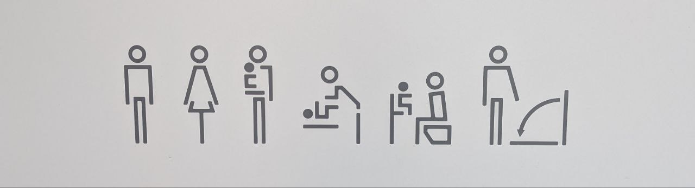
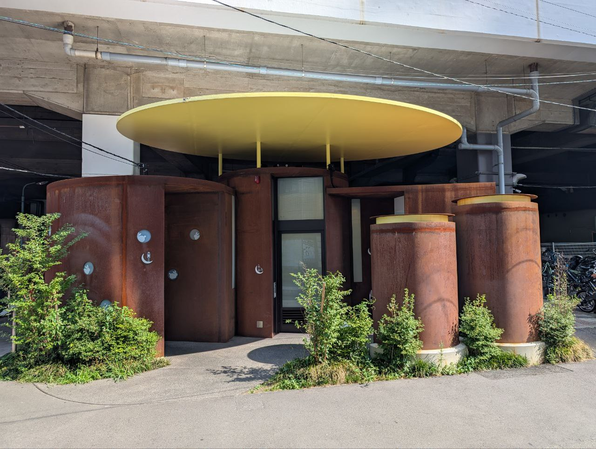
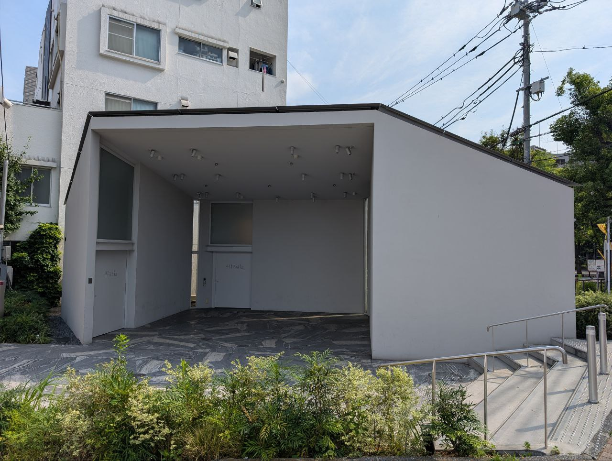
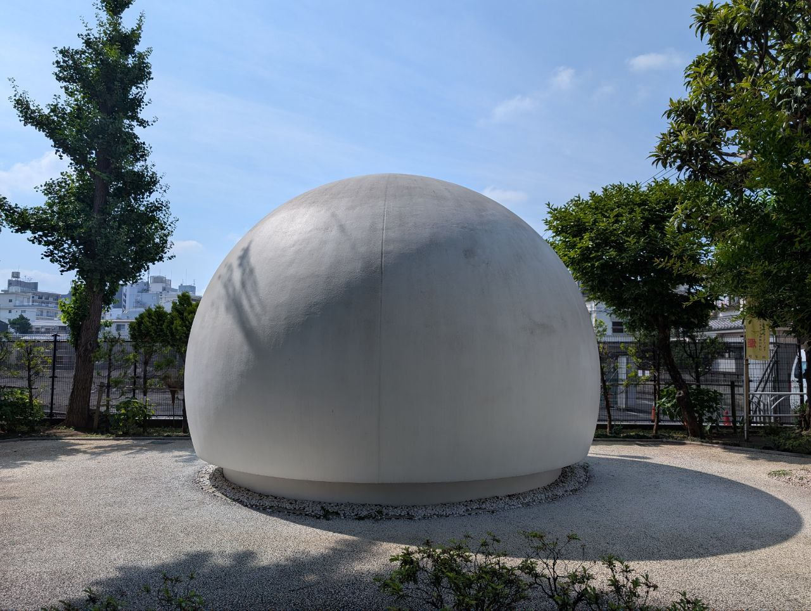
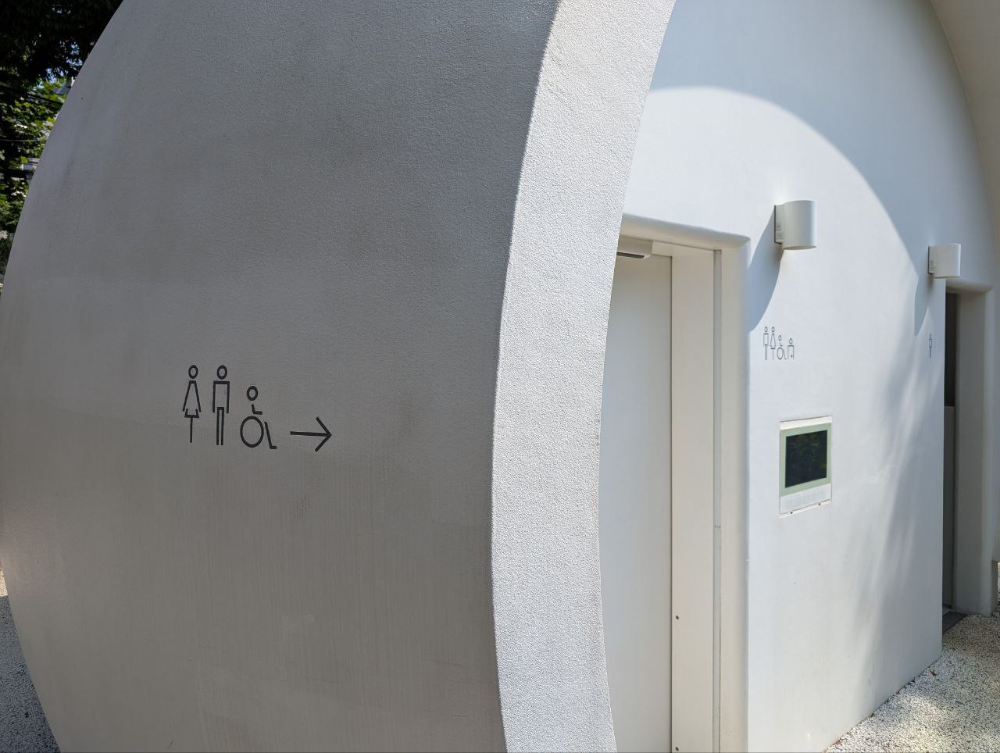
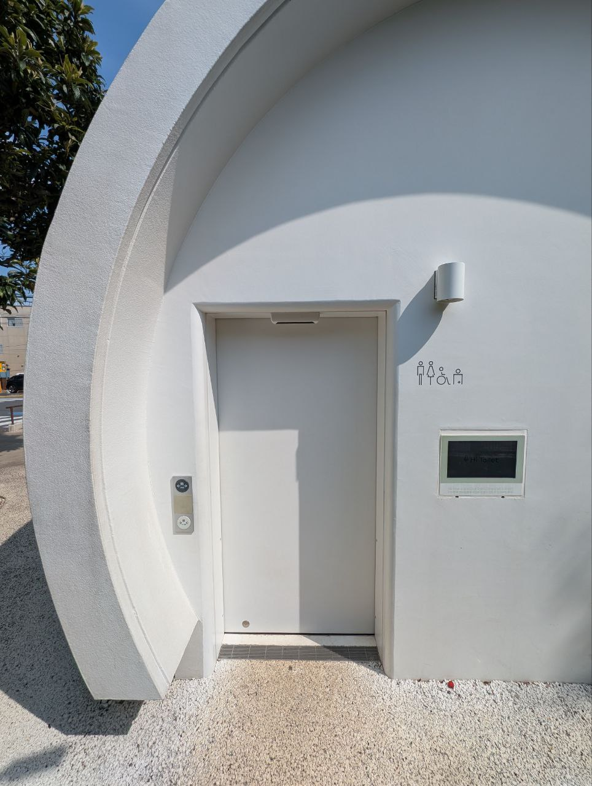
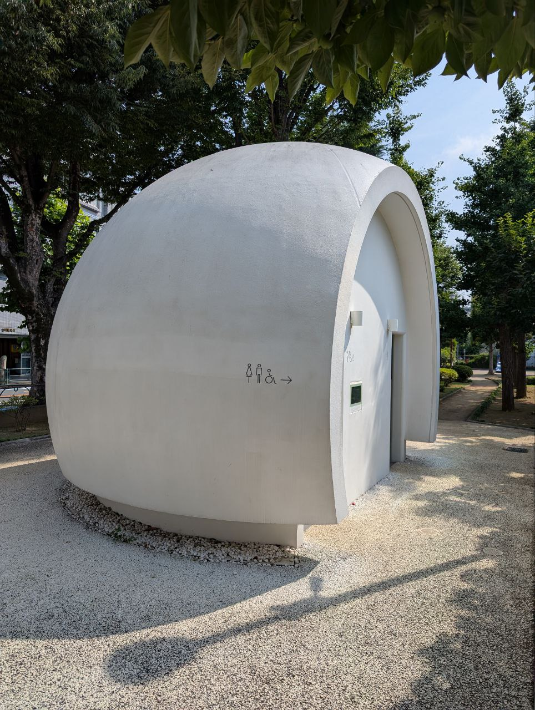

# The Tokyo Toilet Pilgrimage
Date : 17 Aug 2025

On July 1, 2025, while spending the summer in Tokyo, I set out on a "walk" : visiting the [Tokyo Toilet project](https://en.wikipedia.org/wiki/The_Tokyo_Toilet) sites across the city. Inspired by the film [Perfect Days](https://en.wikipedia.org/wiki/Perfect_Days), I left my hotel room at 8 a.m. and began my journey on foot.This is simply a documentation of the photos I took along the way. 

-Honarable mentions 
-Aquarius,Pocari Sweat and Onigiri's i ate from konbini 

1.[Sasazuka Greenway.1-29 Sasazuka, Shibuya](https://maps.app.goo.gl/bcxcm77E32yHMgBn8)  
 

2.[Hatagaya. 3-37-8 Hatagaya](https://maps.app.goo.gl/AUXbS3hi4baDBGRc9) 
 
3.[Nanago Dori Park. 2-53-5 Hatagaya](https://maps.app.goo.gl/bArfkA4iTzpSe4Fq5)
 
 

 