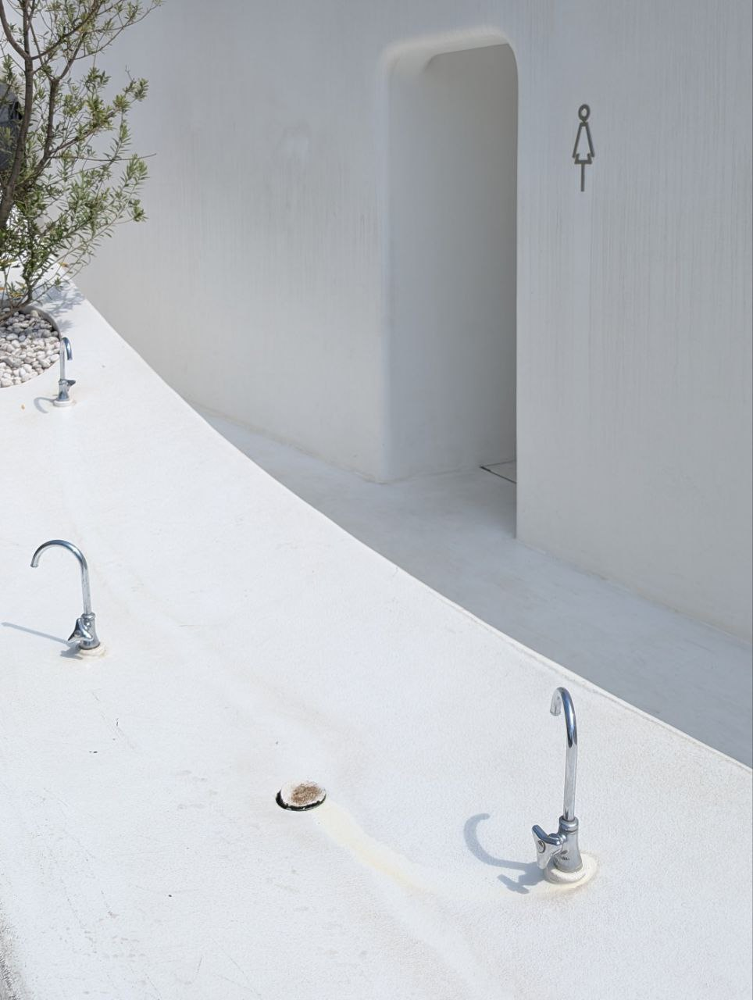
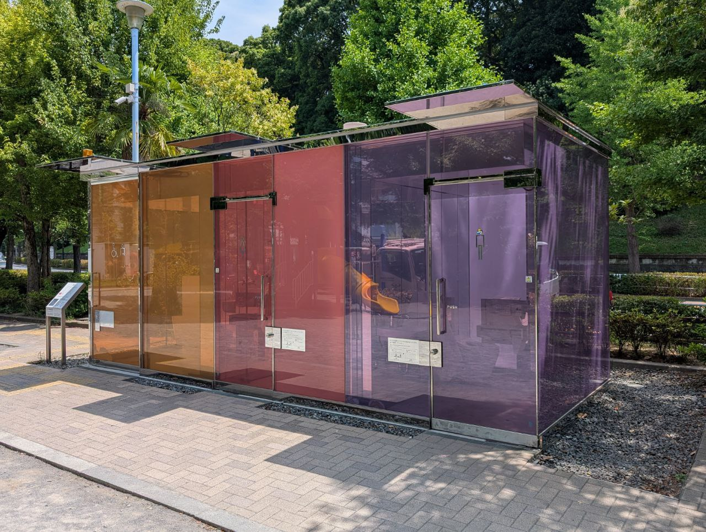
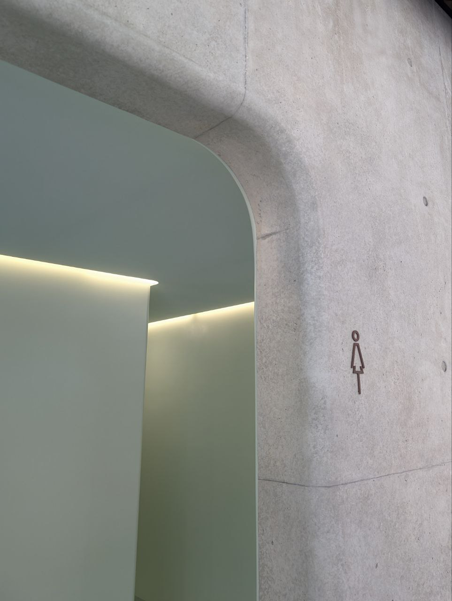
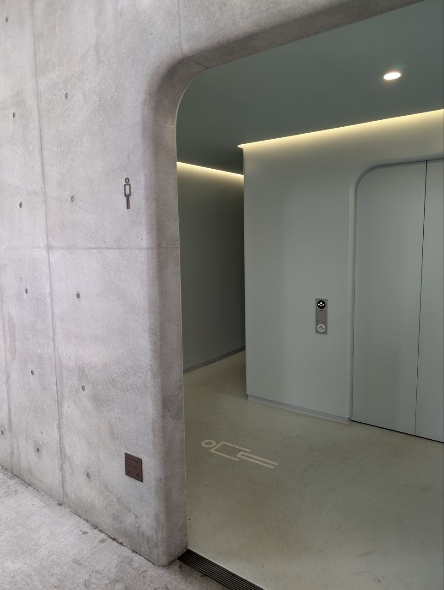

# The Tokyo Toilet Pilgrimage
Date : 17 Aug 2025

On July 1, 2025, while spending the summer in Tokyo, I set out on a "walk" : visiting the [Tokyo Toilet project](https://en.wikipedia.org/wiki/The_Tokyo_Toilet) sites across the city. Inspired by the film [Perfect Days](https://en.wikipedia.org/wiki/Perfect_Days), I left my hotel room at 8 a.m. and began my journey on foot.This is simply a documentation of the photos I took along the way. 

Honarable mentions 
-Aquarius,Pocari Sweat and Onigiri's I ate from konbini 

1.[Sasazuka Greenway.1-29 Sasazuka, Shibuya](https://maps.app.goo.gl/gN2q5iRbxbC7nnLNA)   

 

2.[Hatagaya. 3-37-8 Hatagaya](https://maps.app.goo.gl/H2EMEG8QycZCDJLA8)  

 

3.[Nanago Dori Park. 2-53-5 Hatagaya](https://maps.app.goo.gl/2pvAvQRs8z6XDWcn7)  

 
 

 

4.[Nishihara Itchome Park. 1-29-1 Nishihara](https://maps.app.goo.gl/nJRhMbDMKdwtzUBZA)  

 

 

5.[Nishisando. 3-27-1 Yoyogi](https://maps.app.goo.gl/2BE75aF5uYjYxgUi7)  

 

6.[Yoyogi-Hachiman.5-1-2 Yoyogi](https://maps.app.goo.gl/ARbqGAftDhusCPzo9)  

 

7.[Haru-no-Ogawa Community Park. 5-68-1 Yoyogi](https://maps.app.goo.gl/TH2PEjNCckxuv71eA)  

 

<video width="49%" controls>
  <source src="2025-08-23 18.18.58.mp4" type="video/mp4">
  Your browser does not support the video tag.
</video>

8.[Yoyogi Fukamachi Mini Park. 1-54-1 Tomigaya](https://maps.app.goo.gl/UW6wwYTiV9XadCpQ8)  

9.[Urasando.4-28-1 Sendagaya](https://maps.app.goo.gl/4oTsE1YSLoyE2Tm56)  

 

